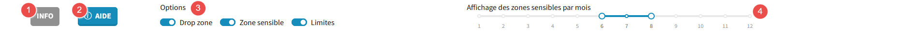

# La barre de contrôle

> La barre de contrôle permet de gérer les différentes fonctionnalités de la carte.

1. **INFO** : Utilisable uniquement en mode instructeur ou en service territorial, ce bouton permet d'afficher les informations relatives à la demande de survol sélectionnée.
2. **AIDE** : Ce bouton permet d'afficher cette aide.
3. **Options** : Ces différents boutons permettent de gérer l'affichage des différentes informations sur la carte comme les drops zones ou les zones sensibles.
4. **Affichage des zones sensibles par mois** : Ce 'slider' permet de selectionner la plage des mois pour lesquels les zones sensibles doivent être affichées.
   par exemple ici, les zones sensibles entre le mois de juin (6) et le mois de d'aout (8) seront affichées. (Juin et aout inclus)