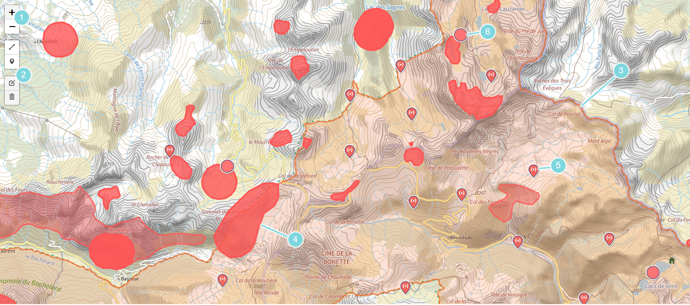

# Carte interactive

> La carte est l'élément central de Carto Editor. Elle permet de visualiser de créer, de modifier et de consulter son plan de vol.

1. **Boutons de zoom** : Ces boutons permettent de zoomer et dézoomer sur la carte (Le zoom est également possible avec la molette de la souris).
2. **Bouton d'édition** : Ce bouton permet de passer en mode édition. Pour plus d'info consulter [Créer un tracé de survol](create_flight.md).
3. **La zone en coeur de parc** : Cette zone transparente et orange délimite le coeur de parc. 
4. **Zone sensible** : Ces zones délimites des endroits sensibles à eviter.
5. **Drop zone** : Ces points définissent des zones de décollage et d'atterissage.
6. **Regroupement de drop zones** : Ces points regroupent plusieurs drop zones. Pour pouvoir les visualiser il faut zoomer sur la carte.